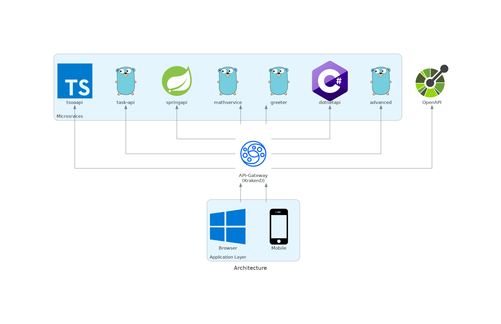

# Declarative API-Gateway for Microservices

This is tool for creating an enterprise API-Gateway for microservices with as less effort as possible. We use a declarative approach without touching configuration files.

What are microservices? What is an API-Gateway? Why do I want all of this? Check this article <https://microservices.io/>.

## What problem does this software solve?

In the real world, we write our REST microservice in Go, DotNet Core, TypeScript, Java, JavaScript or any other super cool language.

Usually, we also integrate OpenAPI <https://www.openapis.org/> for automatically creating documentation and specification of our API.

"Don't repeat yourself!" is a very good software design pattern. When it comes to the API-Gateway we also want to stick with this. Usually this isn't possible and we write a lot of manual routes for Nginx/Apache reverse proxies.

What can we do?

There is KrakenD <https://www.krakend.io/> a very nice and easy to use API-Gateway software. It is easy to configure and solves many things, that Nginx and Apache don't solve out of the box. However, it can't read the specification from OpenAPI Json files.

This project adds a code generator, that will create KranenD endpoints and joined OpenAPI document from your microservices OpenAPI specification.

It also allows filtering internal methods (by using official OpenAPI Extension tags <https://swagger.io/docs/specification/openapi-extensions/>). Filtered methods are not published to the KrakenD API-Gateway.

It also creates a joined OpenAPI document with specifications from all of your microservices. This document can be used, e.g. for your frontend team or your mobile team to create client services. This is a non-trivial approach. We have to take care about OpenAPI security entries and also remove filtered request/response schemas from the joined document.

## Demo Architecture

The sample application consists of a bunch dockered microservices written in different technology. They all provide some hello world nonsense services. Please check the <CREDITS.md> file.

We have examples in:

  - Go
  - DotNet Core
  - TypeScript (Node)
  - Java (Spring)




## Run the examples

  - You need docker, docker-compose, make

### Build
``` bash
$ git clone ...
$ make
```

  - The "templates" folder is copied to "config". This is a foundation of a KrakenD flexible configuration - <https://www.krakend.io/docs/configuration/flexible-config/>

### Run the microservices

  - open a Terminal

``` bash
$ cd microservices
$ make run
```

### Create configuration from your microservices

  - make sure the microservices are running
  - open a Terminal

``` bash
$ make update-krakend-config
```

This will create files:
  - KrakenD: config/krakend/settings/endpoint.json
  - OpenAPI: config/swagger-ui/openapi.json

The code generator will use all microservices specified in:
  - microservices/api-gateway.json

At this moment, we have no kubernetes sample. So it is assumed, that Docker runs on the internal IP: 172.17.0.1. Please change to your needs.

### Run the API Gateway

  - make sure the microservices are running
  - make sure you created the configuration files
  - open a Terminal

``` bash
$ make check-krakend-config
$ make run-krakend
```

  - the API Gateway is now available at <http://localhost:8080>
  - the joined OpenAPI is now available at <http://localhost:8080/docs>
  - the joined OpenAPI JSON file is now available at <http://localhost:8080/docs/static/openapi.json>

### Development Loop

  1. Create/Update/Delete endpoints on your microservice.
  2. Add/Delete 'x-internal' OpenAPI Extensions to show/hide a route on the API-Gateway. Check the example microservices. It's simple.
  3. Build / Restart the microservice (cd microservice && make && make run)
  4. Update the KrakenD config (make update-krakend-config)
     - A KrakenD restart is usually not required
     - KrakenD will automatically update the config, if there are new files.
     - The joined OpenAPI-UI just needs to refresh with the new openapi.json file.
  5. Update all consumers of the Open-API e.g. mobile / web apps.
  6. GOTO 1.

Please read some further documentation about API versioning.

## TODO

A lot at the moment:

  - Add PHP/Rust/... microservices.
  - Add a kubernetes ("homelab") version using kind <https://kind.sigs.k8s.io/docs/user/quick-start/>
  - rewrite the NodeJS based config generator in Go
    - <https://irshadhasmat.medium.com/golang-simple-json-parsing-using-empty-interface-and-without-struct-in-go-language-e56d0e69968>
    - <https://mrwaggel.be/post/golang-reflect-if-initialized-struct-has-member-method-or-fields/>
  - There is sort of a bug with urlencode. Not sure how this occurs. <https://github.com/swaggest/swgui/issues/21>
  - More template config flavours e.g. add SSL layer.

Enhancements for the config generator:

  - add "content types" to routes but not really sure how we can make this happen with multiple response types
  - KrakenD config for this "output_encoding": "json",
  - types in schemas might conflict in the joined OpenAPI document e.g. microservice A might have a "User" and microservice B might have a "User" (with different structure). We need to add some aliasing here. e.g. FooBar_User


More samples (in different Repos)

  - Sample with no Database
  - Sample with Database
  - Sample with OAuth / LDAP / JWT / Security + Internal Security (internal microservices should use API Tokens)


